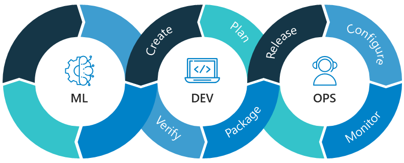

###  **Hello, I'm Tanmaya Chaudhary here.**  

---

<h1>Intro Card Holder Coming Soon.</h1>

A Data Scientist 🔭 with 1.5+years of experience executing data-driven solution to increase efficiency and accuracy. Well-versed & love with AI solution development using Python, SQL and ML tools. 
More Focused on MLOps, Machine learning problems. Enjoying data story telling with insights, and giving solutions for Data Science complex business problems.

- 👋 Currently Working as a **Data Scientist** in **Ernst & Young LLP**. 
- 💞️ Hire Me -> Review my [One Click CV.](https://tanmayachaudhary.github.io/MyPortfolio/)
- 👀 I’m interested in building Artificial Intelligence solutions which will help people to make their lives easy.
- **✨Certifications:-** 😍Microsoft Azure Data Scientist, 🥳Microsoft Azure AI Engineer, 😍Microsoft Azure AI Fundamentals, 🤩Oracle OCI Foundation 2021 Associate. 
- 🌱 I’m currently learning **Machine Learning Operations (MLOps) &**  **Microsoft Azure Cloud Platform.**

- 💬 Ask me about MLOps, Cloud, ML related stuff.

  

---
### Tools & Technologies Preference 

-       
     

-      

-          
    

### Other Languages I know
-   

---
### GitHub Statistics 
 

---
### Find Me Online

 
 

### **Thanks & Regards,** 
### **Mr. Tanmaya Chaudhary**
### **Data Scientist @ Ernst & Young LLP**
